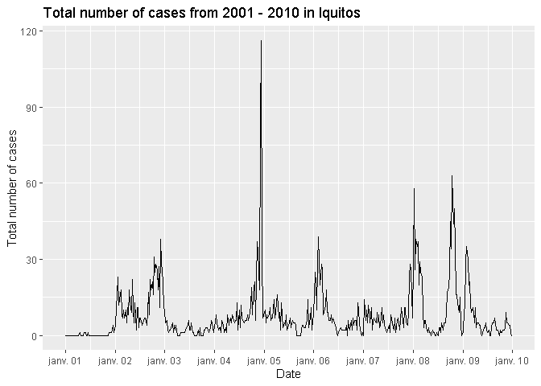
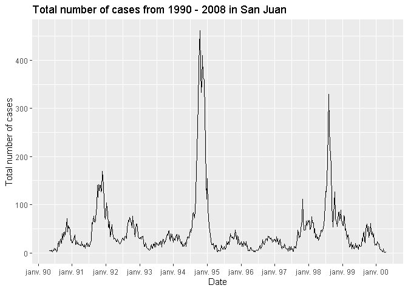
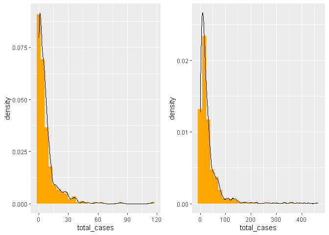

Dengue Forecasting
================
Axel Forveille, MAI Tien Long

## Introduction

The purpose of the project is to predict the number of dengue cases in
two cities, San Juan and Iquitos for each week, using environmental and
climate variables. The challenge was organized in 2015 by several
departments in the U.S. Federal Government (Department of Health and
Human Services, Department of Defense, Department of Commerce, and the
Department of Homeland Security), with the support of the Pandemic
Prediction and Forecasting Science and Technology Interagency Working
Group under the National Science and Technology Council
(<https://dengueforecasting.noaa.gov/>).

#### Data

The data for each city consists of:

-   week indicators.  
-   NOAA’s GHCN daily climate data weather station measurements.  
-   PERSIANN satellite precipitation measurements.
-   NOAA’s NCEP Climate Forecast System Reanalysis measurements.
-   Satellite vegetation.
-   Prediction for the number of cases for each week.

Additionally, we downloaded the social and economic data from WorldBank
and we chose several parameters that might explain the number of cases:

-   Total population  
-   population_density_people_per_sq_km_of_land_area  
-   forest_area_sq_km  
-   gdp_current_us  
-   employment_to_population_average  
-   Population age percentage: 0 - 9, 10 - 20, 20 - 60, 60+

Another data that can affect the spread of the disease is the number of
migration, however, we couldn’t find the data.

#### Methods

##### Negative Binomial Distribution model

As the total number of cases does not follow a Gaussian distribution,
and this is a counting variable, we should use the Poisson distribution
or the Negative Binomial distribution model.

##### Model GAM

##### Regression Tree

##### Random Forest

##### Times Series

##### Gradient Boosting

## Data Wrangling and Exploration

#### Data Wrangling

##### Data from the challenge

We separate the data into two parts for each country and add the missing
values using spline interpolation.

##### Data from WorldBank

We download the data from WorldBank and we select important variables
that might contribute to the prediction of the number of Dengue cases:
\* Total population  
\* population_density_people_per_sq_km_of_land_area  
\* forest_area_sq_km  
\* gdp_current_us  
\* employment_to_population_average  
\* Population age percentage: 0 - 9, 10 - 20, 20 - 60, 60+

#### Data Exploration

For each city, we have the following variables:

``` r
# import the cleaned data
load("rdas/merged_iq_train.rda")
load("rdas/merged_sj_train.rda")
names(merged_iq_train)
```

    ##  [1] "year"                                            
    ##  [2] "weekofyear"                                      
    ##  [3] "population_total"                                
    ##  [4] "population_density_people_per_sq_km_of_land_area"
    ##  [5] "forest_area_sq_km"                               
    ##  [6] "gdp_current_us"                                  
    ##  [7] "employment_to_population_average"                
    ##  [8] "population_ages_0_9_percent"                     
    ##  [9] "population_ages_10_20_percent"                   
    ## [10] "population_ages_20_60_percent"                   
    ## [11] "population_ages_over_60_percent"                 
    ## [12] "city"                                            
    ## [13] "week_start_date"                                 
    ## [14] "ndvi_ne"                                         
    ## [15] "ndvi_nw"                                         
    ## [16] "ndvi_se"                                         
    ## [17] "ndvi_sw"                                         
    ## [18] "precipitation_amt_mm"                            
    ## [19] "reanalysis_air_temp_k"                           
    ## [20] "reanalysis_avg_temp_k"                           
    ## [21] "reanalysis_dew_point_temp_k"                     
    ## [22] "reanalysis_max_air_temp_k"                       
    ## [23] "reanalysis_min_air_temp_k"                       
    ## [24] "reanalysis_precip_amt_kg_per_m2"                 
    ## [25] "reanalysis_relative_humidity_percent"            
    ## [26] "reanalysis_sat_precip_amt_mm"                    
    ## [27] "reanalysis_specific_humidity_g_per_kg"           
    ## [28] "reanalysis_tdtr_k"                               
    ## [29] "station_avg_temp_c"                              
    ## [30] "station_diur_temp_rng_c"                         
    ## [31] "station_max_temp_c"                              
    ## [32] "station_min_temp_c"                              
    ## [33] "station_precip_mm"                               
    ## [34] "total_cases"

##### Visualising the number of cases over the year:

<!-- --><!-- -->

``` r
# draw the two histograms
iq_histogram <- ggplot(data=merged_iq_train, aes(total_cases)) +
  geom_histogram(aes(y =..density..), fill = "orange") +
  geom_density()

sj_histogram <- ggplot(data=merged_sj_train, aes(total_cases)) +
  geom_histogram(aes(y =..density..), fill = "orange") +
  geom_density()

grid.arrange(iq_histogram, sj_histogram, ncol=2)
```

    ## `stat_bin()` using `bins = 30`. Pick better value with `binwidth`.
    ## `stat_bin()` using `bins = 30`. Pick better value with `binwidth`.

<!-- -->

``` r
mean(merged_iq_train$total_cases)
```

    ## [1] 7.565385

``` r
var(merged_iq_train$total_cases)
```

    ## [1] 115.8955

``` r
mean(merged_sj_train$total_cases)
```

    ## [1] 34.18056

``` r
var(merged_sj_train$total_cases)
```

    ## [1] 2640.045

Some observations:

-   There are more cases in San Juan than Iquitos  
-   There are the peaks that we would like to predict. They happen in
    what months? Are there periods or seasonality trends?  
-   The number of cases for both cities do not follow Gaussian
    distributions. It suggests that we should use Generalized Linear
    Model, as described in Simon N. Wood’s book: Generalized Additive
    Models. The number of cases are natural numbers, we will assume that
    they follow Poisson distribution or Negative Binomial distribution,
    and in particular Negative Binomial distribution as the mean is much
    smaller than the variance. In fact, the Poisson distribution can be
    interpreted as a special case of the Negative Binomial distribution
    when the parameter *r* → ∞ and is used as a way to model an
    over-dispersed Poisson distribution.

## Modeling and Prediction

### Preparing the data for training and testing

A simple method for training and evaluating the models, simple
validation, is to split the data into training set and testing set. As
our data is time series, instead of a random split, we should split our
time series with respect to chronology, so that we could train our
models on the past data, and test the predictions on the future. To
improve consistency, we will use instead an analogue of cross validation
for time series, called sliding windows.

``` r
knitr::include_graphics(here::here("", "figs/sliding_windows_method.png"))
```


To implement the method, we will choose the length of the training set
train_size, the length of the test set test_size, and the step_size that
we will move. The step_size corresponds to the length of the dropped
part in Pass 2 in the picture. We implement the function below to build
a list of (start_train, end_train, start_test, end_test) to train and
evaluate the models.

``` r
# The following function implements the Sliding windows method, 
# an analogue of Cross Validation for Time Series
# The following function receives an input of train_size, test_size, step_size 
# and returns a list of vectors of 4 parameters:
# (start_train, end_train, start_test, end_test)

build_sliding_windows <- function(dataset, train_size, test_size, step_size) {
  start_train <- 1 
  end_train <- start_train + train_size - 1
  start_test <- end_train + 1
  end_test <- start_test + test_size - 1
  
  plans <- list()
  while (end_test < nrow(dataset)) {
    plans_length = length(plans)
    plans[[plans_length + 1]] <- c(start_train, end_train, start_test, end_test)
    
    start_train <- start_train + step_size
    end_train <- start_train + train_size - 1
    start_test <- end_train + 1
    end_test <- start_test + test_size - 1
  }
  plans
}
```

Applying to our dataset, we will choose:  
\* train_size = 60% of the length of the dataset  
\* test_size = 20 % of the length of the dataset  
\* step_size = 10

``` r
sj_train_size <- round(nrow(merged_sj_train) * 0.6)
sj_test_size <- round(nrow(merged_sj_train) * 0.2)
sj_step_size <- 10
sj_plans <- build_sliding_windows(merged_sj_train, sj_train_size, sj_test_size, sj_step_size)
sj_plans
```

    ## [[1]]
    ## [1]   1 562 563 749
    ## 
    ## [[2]]
    ## [1]  11 572 573 759
    ## 
    ## [[3]]
    ## [1]  21 582 583 769
    ## 
    ## [[4]]
    ## [1]  31 592 593 779
    ## 
    ## [[5]]
    ## [1]  41 602 603 789
    ## 
    ## [[6]]
    ## [1]  51 612 613 799
    ## 
    ## [[7]]
    ## [1]  61 622 623 809
    ## 
    ## [[8]]
    ## [1]  71 632 633 819
    ## 
    ## [[9]]
    ## [1]  81 642 643 829
    ## 
    ## [[10]]
    ## [1]  91 652 653 839
    ## 
    ## [[11]]
    ## [1] 101 662 663 849
    ## 
    ## [[12]]
    ## [1] 111 672 673 859
    ## 
    ## [[13]]
    ## [1] 121 682 683 869
    ## 
    ## [[14]]
    ## [1] 131 692 693 879
    ## 
    ## [[15]]
    ## [1] 141 702 703 889
    ## 
    ## [[16]]
    ## [1] 151 712 713 899
    ## 
    ## [[17]]
    ## [1] 161 722 723 909
    ## 
    ## [[18]]
    ## [1] 171 732 733 919
    ## 
    ## [[19]]
    ## [1] 181 742 743 929

``` r
iq_train_size <- round(nrow(merged_iq_train) * 0.6)
iq_test_size <- round(nrow(merged_iq_train) * 0.2)
iq_step_size <- 10
iq_plans <- build_sliding_windows(merged_iq_train, iq_train_size, iq_test_size, iq_step_size)
iq_plans
```

    ## [[1]]
    ## [1]   1 312 313 416
    ## 
    ## [[2]]
    ## [1]  11 322 323 426
    ## 
    ## [[3]]
    ## [1]  21 332 333 436
    ## 
    ## [[4]]
    ## [1]  31 342 343 446
    ## 
    ## [[5]]
    ## [1]  41 352 353 456
    ## 
    ## [[6]]
    ## [1]  51 362 363 466
    ## 
    ## [[7]]
    ## [1]  61 372 373 476
    ## 
    ## [[8]]
    ## [1]  71 382 383 486
    ## 
    ## [[9]]
    ## [1]  81 392 393 496
    ## 
    ## [[10]]
    ## [1]  91 402 403 506
    ## 
    ## [[11]]
    ## [1] 101 412 413 516

### Generalized Linear Models with Negative Binomial Distribution family.

### GAM models

### Regression Tree

In this session, we look at Regression tree, a simple method that
doesn’t require any assumption on the distribution of the variables. It
gives a simple method to choose the variables.

### Random Forest

### Times Series (ARIMA/SARIMA)

### Gradient Boosting

## Conclusion
