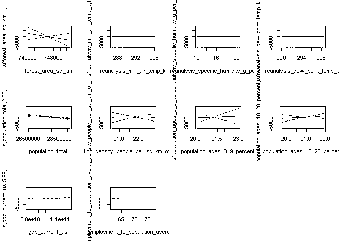
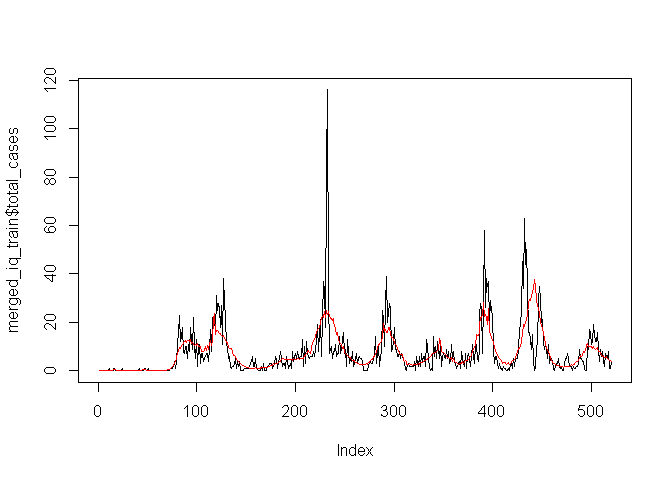
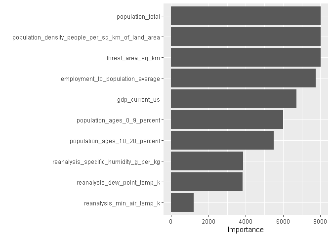
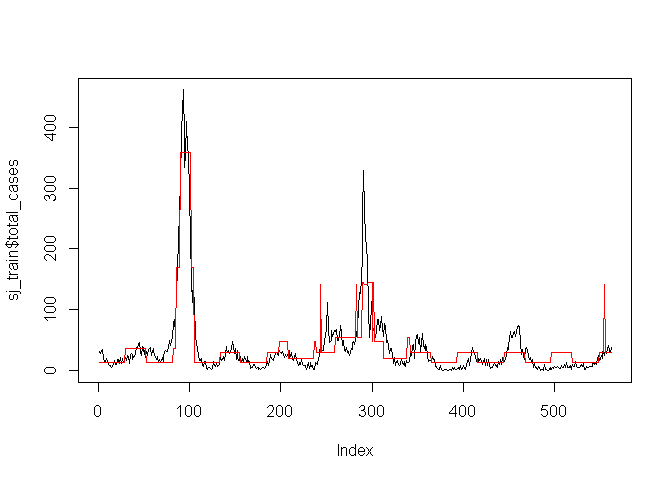

Dengue Forecasting
================
Axel Forveille, MAI Tien Long

## Introduction

The purpose of the project is to predict the number of dengue cases in
two cities, San Juan and Iquitos for each week, using environmental and
climate variables. The challenge was organized in 2015 by several
departments in the U.S. Federal Government (Department of Health and
Human Services, Department of Defense, Department of Commerce, and the
Department of Homeland Security), with the support of the Pandemic
Prediction and Forecasting Science and Technology Interagency Working
Group under the National Science and Technology Council
(<https://dengueforecasting.noaa.gov/>).

#### Data

The data for each city consists of:

-   Time indicators
-   NOAA’s GHCN daily climate data weather station measurements.  
-   PERSIANN satellite precipitation measurements.  
-   NOAA’s NCEP Climate Forecast System Reanalysis measurements.
-   Satellite vegetation.
-   The number of cases for each week.

Additionally, we downloaded the environmental, social and economic data
from WorldBank and we chose several parameters that might explain the
number of cases:

-   forest_area_sq_km
-   Total population  
-   population_density_people_per_sq_km_of_land_area  
-   gdp_current_us  
-   employment_to_population_average  
-   Population age percentage: 0 - 9, 10 - 20, 20 - 60, 60+

Another data that can affect the spread of the disease is the number of
migration, however, we couldn’t find the data.

#### Methods

##### Negative Binomial Distribution model

As the total number of cases does not follow a Gaussian distribution,
and this is a counting variable, we should use the Poisson distribution
or the Negative Binomial distribution model.

##### Model GAM

##### Regression Tree

##### Random Forest

##### Times Series

##### Gradient Boosting

## Data Wrangling and Exploration

#### Data Wrangling

##### Data from the challenge

The data for each city consists of:

-   Time indicators:
    -   week_start_date  
    -   year
-   NOAA’s GHCN daily climate data weather station measurements.
    -   station_max_temp_c - maximum temperature  
    -   station_min_temp_c - minimum temperature  
    -   station_avg_temp_c - average temperature  
    -   station_precip_mm - total precipitation  
    -   station_diur_temp_rng_c - diurnal temperature range
-   PERSIANN satellite precipitation measurements.
    -   precipitation_amt_mm - total precipitation  
-   NOAA’s NCEP Climate Forecast System Reanalysis measurements.
    -   reanalysis_sat_precip_amt_mm – Total precipitation
    -   reanalysis_dew_point_temp_k – Mean dew point temperature
    -   reanalysis_air_temp_k – Mean air temperature
    -   reanalysis_relative_humidity_percent – Mean relative humidity
    -   reanalysis_specific_humidity_g\_per_kg – Mean specific humidity
    -   reanalysis_precip_amt_kg_per_m2 – Total precipitation
    -   reanalysis_max_air_temp_k – Maximum air temperature
    -   reanalysis_min_air_temp_k – Minimum air temperature
    -   reanalysis_avg_temp_k – Average air temperature
    -   reanalysis_tdtr_k – Diurnal temperature range
-   Satellite vegetation.
    -   ndvi_se – Pixel southeast of city centroid
    -   ndvi_sw – Pixel southwest of city centroid
    -   ndvi_ne – Pixel northeast of city centroid
    -   ndvi_nw – Pixel northwest of city centroid

We separate the data into two parts for each country and add the missing
values using spline interpolation.

##### Data from WorldBank

We download the data from WorldBank, clean and select important
variables that might contribute to the prediction of the number of
Dengue cases: \* Total population  
\* population_density_people_per_sq_km_of_land_area  
\* forest_area_sq_km  
\* gdp_current_us  
\* employment_to_population_average  
\* Population age percentage: 0 - 9, 10 - 20, 20 - 60, 60+

We see that all the explicable variables make sense. We can group them
into the following groups: \* Climate variables  
\* Time of the year  
\* Total population  
\* Population density  
\* Population age  
\* Economical condition  
There are several variables from climate variables correlate with each
other.

#### Data Exploration

For each city, we have the following variables:

``` r
# import the cleaned data
load("rdas/merged_iq_train.rda")
load("rdas/merged_sj_train.rda")
names(merged_iq_train)
```

    ##  [1] "year"                                            
    ##  [2] "weekofyear"                                      
    ##  [3] "population_total"                                
    ##  [4] "population_density_people_per_sq_km_of_land_area"
    ##  [5] "forest_area_sq_km"                               
    ##  [6] "gdp_current_us"                                  
    ##  [7] "employment_to_population_average"                
    ##  [8] "population_ages_0_9_percent"                     
    ##  [9] "population_ages_10_20_percent"                   
    ## [10] "population_ages_20_60_percent"                   
    ## [11] "population_ages_over_60_percent"                 
    ## [12] "city"                                            
    ## [13] "week_start_date"                                 
    ## [14] "ndvi_ne"                                         
    ## [15] "ndvi_nw"                                         
    ## [16] "ndvi_se"                                         
    ## [17] "ndvi_sw"                                         
    ## [18] "precipitation_amt_mm"                            
    ## [19] "reanalysis_air_temp_k"                           
    ## [20] "reanalysis_avg_temp_k"                           
    ## [21] "reanalysis_dew_point_temp_k"                     
    ## [22] "reanalysis_max_air_temp_k"                       
    ## [23] "reanalysis_min_air_temp_k"                       
    ## [24] "reanalysis_precip_amt_kg_per_m2"                 
    ## [25] "reanalysis_relative_humidity_percent"            
    ## [26] "reanalysis_sat_precip_amt_mm"                    
    ## [27] "reanalysis_specific_humidity_g_per_kg"           
    ## [28] "reanalysis_tdtr_k"                               
    ## [29] "station_avg_temp_c"                              
    ## [30] "station_diur_temp_rng_c"                         
    ## [31] "station_max_temp_c"                              
    ## [32] "station_min_temp_c"                              
    ## [33] "station_precip_mm"                               
    ## [34] "total_cases"

##### Visualising the number of cases over the year:

<!-- --><!-- -->

``` r
# draw the two histograms
iq_histogram <- ggplot(data=merged_iq_train, aes(total_cases)) +
  geom_histogram(aes(y =..density..), fill = "orange") +
  geom_density()

sj_histogram <- ggplot(data=merged_sj_train, aes(total_cases)) +
  geom_histogram(aes(y =..density..), fill = "orange") +
  geom_density()

grid.arrange(iq_histogram, sj_histogram, ncol=2)
```

    ## `stat_bin()` using `bins = 30`. Pick better value with `binwidth`.
    ## `stat_bin()` using `bins = 30`. Pick better value with `binwidth`.

<!-- -->

``` r
mean(merged_iq_train$total_cases)
```

    ## [1] 7.565385

``` r
var(merged_iq_train$total_cases)
```

    ## [1] 115.8955

``` r
mean(merged_sj_train$total_cases)
```

    ## [1] 34.18056

``` r
var(merged_sj_train$total_cases)
```

    ## [1] 2640.045

Some observations:

-   There are more cases in San Juan than Iquitos  
-   There are the peaks that we would like to predict. They happen in
    what months? Are there periods or seasonality trends?  
-   The number of cases for both cities do not follow Gaussian
    distributions. It suggests that we should use Generalized Linear
    Model, as described in Simon N. Wood’s book: Generalized Additive
    Models. The number of cases are natural numbers, we will assume that
    they follow Poisson distribution or Negative Binomial distribution,
    and in particular Negative Binomial distribution as the mean is much
    smaller than the variance. In fact, the Poisson distribution can be
    interpreted as a special case of the Negative Binomial distribution
    when the parameter *r* → ∞ and is used as a way to model an
    over-dispersed Poisson distribution.

## Modeling and Prediction

### Preparing the data for training and testing

A simple method for training and evaluating the models, simple
validation, is to split the data into training set and testing set. As
our data is time series, instead of a random split, we should split our
time series with respect to chronology, so that we could train our
models on the past data, and test the predictions on the future. To
improve consistency, we will use instead an analogue of cross validation
for time series, called sliding windows.

``` r
knitr::include_graphics(here::here("", "figs/sliding_windows_method.png"))
```


To implement the method, we will choose the length of the training set
train_size, the length of the test set test_size, and the step_size that
we will move. The step_size corresponds to the length of the dropped
part in Pass 2 in the picture. We implement the function below to build
a list of (start_train, end_train, start_test, end_test) to train and
evaluate the models.

``` r
# The following function implements the Sliding windows method, 
# an analogue of Cross Validation for Time Series
# The following function receives an input of train_size, test_size, step_size 
# and returns a list of vectors of 4 parameters:
# (start_train, end_train, start_test, end_test)

build_sliding_windows <- function(dataset, train_size, test_size, step_size) {
  start_train <- 1 
  end_train <- start_train + train_size - 1
  start_test <- end_train + 1
  end_test <- start_test + test_size - 1
  
  plans <- list()
  while (end_test < nrow(dataset)) {
    plans_length = length(plans)
    plans[[plans_length + 1]] <- c(start_train, end_train, start_test, end_test)
    
    start_train <- start_train + step_size
    end_train <- start_train + train_size - 1
    start_test <- end_train + 1
    end_test <- start_test + test_size - 1
  }
  plans
}
```

Applying to our dataset, we will choose:  
\* train_size = 60% of the length of the dataset  
\* test_size = 20 % of the length of the dataset  
\* step_size = 20 weeks  
The procedure then gives 10 and 6 folds for San Juan and Iquitos.

``` r
sj_train_size <- round(nrow(merged_sj_train) * 0.6)
sj_test_size <- round(nrow(merged_sj_train) * 0.2)
sj_step_size <- 20
sj_plans <- build_sliding_windows(merged_sj_train, sj_train_size, sj_test_size, sj_step_size)
sj_plans
```

    ## [[1]]
    ## [1]   1 562 563 749
    ## 
    ## [[2]]
    ## [1]  21 582 583 769
    ## 
    ## [[3]]
    ## [1]  41 602 603 789
    ## 
    ## [[4]]
    ## [1]  61 622 623 809
    ## 
    ## [[5]]
    ## [1]  81 642 643 829
    ## 
    ## [[6]]
    ## [1] 101 662 663 849
    ## 
    ## [[7]]
    ## [1] 121 682 683 869
    ## 
    ## [[8]]
    ## [1] 141 702 703 889
    ## 
    ## [[9]]
    ## [1] 161 722 723 909
    ## 
    ## [[10]]
    ## [1] 181 742 743 929

``` r
iq_train_size <- round(nrow(merged_iq_train) * 0.6)
iq_test_size <- round(nrow(merged_iq_train) * 0.2)
iq_step_size <- 20
iq_plans <- build_sliding_windows(merged_iq_train, iq_train_size, iq_test_size, iq_step_size)
iq_plans
```

    ## [[1]]
    ## [1]   1 312 313 416
    ## 
    ## [[2]]
    ## [1]  21 332 333 436
    ## 
    ## [[3]]
    ## [1]  41 352 353 456
    ## 
    ## [[4]]
    ## [1]  61 372 373 476
    ## 
    ## [[5]]
    ## [1]  81 392 393 496
    ## 
    ## [[6]]
    ## [1] 101 412 413 516

We will use this procedure to evaluate different models later.

``` r
mae<-function(y, ychap)
{
  return(round(mean(abs(y-ychap)), digit = 2))
}
```

### Generalized Linear Models with Negative Binomial Distribution family.

### GAM models

``` r
library(mgcv)
```

    ## Le chargement a nécessité le package : nlme

    ## 
    ## Attachement du package : 'nlme'

    ## L'objet suivant est masqué depuis 'package:dplyr':
    ## 
    ##     collapse

    ## This is mgcv 1.8-38. For overview type 'help("mgcv-package")'.

``` r
library(tidymv)
library(mgcViz)
```

    ## Le chargement a nécessité le package : qgam

    ## Registered S3 method overwritten by 'GGally':
    ##   method from   
    ##   +.gg   ggplot2

    ## Registered S3 method overwritten by 'mgcViz':
    ##   method from  
    ##   +.gg   GGally

    ## 
    ## Attachement du package : 'mgcViz'

    ## Les objets suivants sont masqués depuis 'package:stats':
    ## 
    ##     qqline, qqnorm, qqplot

``` r
g3 <- gam(total_cases ~ s(forest_area_sq_km) + s(reanalysis_min_air_temp_k) + s(reanalysis_specific_humidity_g_per_kg)        
  + s(reanalysis_dew_point_temp_k) 
  + s(population_total) 
  + s(population_density_people_per_sq_km_of_land_area)   
  + s(population_ages_0_9_percent)        
  + s(population_ages_10_20_percent)  
  + s(gdp_current_us)   
  + s(employment_to_population_average), 
          SELECT = TRUE,family = nb(), data = merged_iq_train, method="REML")
summary(g3)
```

    ## 
    ## Family: Negative Binomial(2.856) 
    ## Link function: log 
    ## 
    ## Formula:
    ## total_cases ~ s(forest_area_sq_km) + s(reanalysis_min_air_temp_k) + 
    ##     s(reanalysis_specific_humidity_g_per_kg) + s(reanalysis_dew_point_temp_k) + 
    ##     s(population_total) + s(population_density_people_per_sq_km_of_land_area) + 
    ##     s(population_ages_0_9_percent) + s(population_ages_10_20_percent) + 
    ##     s(gdp_current_us) + s(employment_to_population_average)
    ## 
    ## Parametric coefficients:
    ##             Estimate Std. Error z value Pr(>|z|)    
    ## (Intercept)  1.15662    0.09171   12.61   <2e-16 ***
    ## ---
    ## Signif. codes:  0 '***' 0.001 '**' 0.01 '*' 0.05 '.' 0.1 ' ' 1
    ## 
    ## Approximate significance of smooth terms:
    ##                                                       edf Ref.df Chi.sq p-value
    ## s(forest_area_sq_km)                                1.000  1.000  1.055 0.30443
    ## s(reanalysis_min_air_temp_k)                        1.000  1.001  0.121 0.72818
    ## s(reanalysis_specific_humidity_g_per_kg)            3.651  4.716  7.407 0.17994
    ## s(reanalysis_dew_point_temp_k)                      1.000  1.000  5.597 0.01800
    ## s(population_total)                                 2.345  2.480 13.465 0.00418
    ## s(population_density_people_per_sq_km_of_land_area) 3.345  3.480  0.329 0.98094
    ## s(population_ages_0_9_percent)                      1.000  1.000  0.070 0.79177
    ## s(population_ages_10_20_percent)                    6.264  6.567 23.915 0.04258
    ## s(gdp_current_us)                                   5.991  6.270 49.943 < 2e-16
    ## s(employment_to_population_average)                 6.899  7.473 44.568 < 2e-16
    ##                                                        
    ## s(forest_area_sq_km)                                   
    ## s(reanalysis_min_air_temp_k)                           
    ## s(reanalysis_specific_humidity_g_per_kg)               
    ## s(reanalysis_dew_point_temp_k)                      *  
    ## s(population_total)                                 ** 
    ## s(population_density_people_per_sq_km_of_land_area)    
    ## s(population_ages_0_9_percent)                         
    ## s(population_ages_10_20_percent)                    *  
    ## s(gdp_current_us)                                   ***
    ## s(employment_to_population_average)                 ***
    ## ---
    ## Signif. codes:  0 '***' 0.001 '**' 0.01 '*' 0.05 '.' 0.1 ' ' 1
    ## 
    ## Rank: 90/91
    ## R-sq.(adj) =  0.386   Deviance explained = 69.4%
    ## -REML = 1357.7  Scale est. = 1         n = 520

``` r
plot(g3, pages = 1)
```

<!-- -->

``` r
ychap <- predict(g3, newdata = merged_iq_train, type = "response")
plot(merged_iq_train$total_cases, type='l')
lines(ychap,col='red')
```

<!-- -->

### Regression Tree

In this section, we look at Regression tree, a simple method that
doesn’t require any assumption on the distribution of the variables, and
moreover, gives a way to select variables.

``` r
library(rpart)
library(tree)
library(rpart.plot)
library(vip) # for feature importance
```

We first look at Iquitos:

``` r
# remove the results = 'hide' to see all the graphs for all the models in the Cross Validation.
iq_mae <- c()
for (iq_plan in iq_plans){
  iq_train <- merged_iq_train %>% slice(iq_plan[1]:iq_plan[2]) %>%
      select(-c(year, weekofyear))
  iq_test <- merged_iq_train %>% slice(iq_plan[3]:iq_plan[4]) %>%
      select(-c(year, weekofyear))
  tree_iq <- rpart(formula = total_cases ~ ., 
                 data = iq_train,
                 method = "anova")
  rpart.plot(tree_iq)
  ychap.tree_iq <- predict(tree_iq, newdata = iq_train)
  plot(iq_train$total_cases, type='l')
  lines(ychap.tree_iq,col='red')
  ychap.tree_iq <- predict(tree_iq, newdata = iq_test)
  mae(iq_test$total_cases, ychap.tree_iq)
  iq_mae <- append(iq_mae, mae(iq_test$total_cases, ychap.tree_iq))
  plot(iq_test$total_cases, type='l')
  lines(ychap.tree_iq,col='red')
  print(vip(tree_iq, num_features = 10, bar = FALSE)) # return the importance of the features
}
```

<!-- --><!-- --><!-- --><!-- --><!-- --><!-- --><!-- --><!-- --><!-- --><!-- --><!-- --><!-- --><!-- --><!-- --><!-- --><!-- --><!-- --><!-- --><!-- --><!-- --><!-- --><!-- --><!-- --><!-- -->
For San Juan:

``` r
# remove the results = 'hide' to see all the graphs for all the models in the Cross Validation.
sj_mae <- c()
for (sj_plan in sj_plans){
  sj_train <- merged_sj_train %>% slice(sj_plan[1]:sj_plan[2])
  sj_test <- merged_sj_train %>% slice(sj_plan[3]:sj_plan[4])
  tree_sj <- rpart(formula = total_cases ~ ., 
                 data = sj_train,
                 method = "anova")
  rpart.plot(tree_sj)
  ychap.tree_sj <- predict(tree_sj, newdata = sj_train)
  plot(sj_train$total_cases, type='l')
  lines(ychap.tree_sj,col='red')
  ychap.tree_sj <- predict(tree_sj, newdata = sj_test)
  mae(sj_test$total_cases, ychap.tree_sj)
  sj_mae <- append(sj_mae, mae(sj_test$total_cases, ychap.tree_sj))
  plot(sj_test$total_cases, type='l')
  lines(ychap.tree_sj,col='red')
  print(vip(tree_sj, num_features = 10, bar = FALSE)) # return the importance of the features
}
```

<!-- --><!-- --><!-- --><!-- --><!-- --><!-- --><!-- --><!-- --><!-- --><!-- --><!-- --><!-- --><!-- --><!-- --><!-- --><!-- --><!-- --><!-- --><!-- --><!-- --><!-- --><!-- --><!-- --><!-- --><!-- --><!-- --><!-- --><!-- --><!-- --><!-- --><!-- --><!-- --><!-- --><!-- --><!-- --><!-- --><!-- --><!-- --><!-- --><!-- -->

``` r
mean(iq_mae)
```

    ## [1] 11.13833

``` r
mean(sj_mae)
```

    ## [1] 28.181

#### Conclusion:

##### For Iquitos:

-   The Cross Validation mean MAE score for Iquitos is 7.76.
-   Going through different models in CV, we collect the important
    features to predict the number of cases:
    -   forest_area_sq_km  
    -   reanalysis_min_air_temp_k  
    -   reanalysis_specific_humidity_g\_per_kg  
    -   reanalysis_dew_point_temp_k  
    -   reanalysis_precip_amt_kg_per_m2  
    -   ndvi_nw  
    -   station_avg_temp_c  
    -   station_max_temp_c  
    -   population_total  
    -   population_density_people_per_sq_km_of_land_area  
    -   population_ages_0\_9_percent  
    -   population_ages_10_20_percent  
    -   gdp_current_us  
    -   employment_to_population_average

##### For San Juan:

-   The Cross Validation mean MAE score for San Juan is 28.181
-   Going through different models in CV, we collect the important
    features to predict the number of cases:
    -   ndvi_se  
    -   ndvi_nw  
    -   ndvi_sw  
    -   reanalysis_dew_point_temp_k  
    -   reanalysis_specific_humidity_g\_per_kg  
    -   renalysis_max_air_temp_k  
    -   forest_area_sq_km  
    -   population_total  
    -   population_density_people_per_sq_km_of_land_area
    -   population_ages_0\_9_percent  
    -   gdp_current_us  
    -   employment_to_population_average

We should remark that Regression Tree minimizes the residual sum of
squares error and we are looking at min MAE error.

### Random Forest

### Times Series (ARIMA/SARIMA)

### Gradient Boosting

## Conclusion
